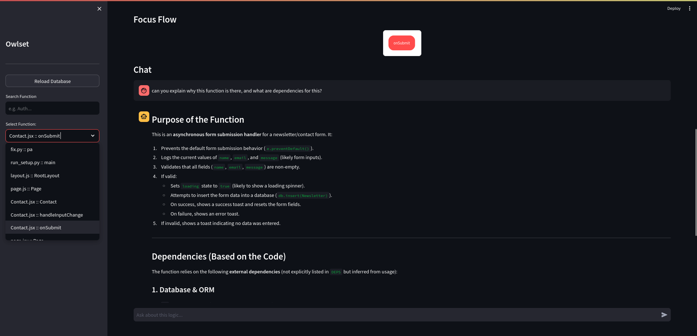
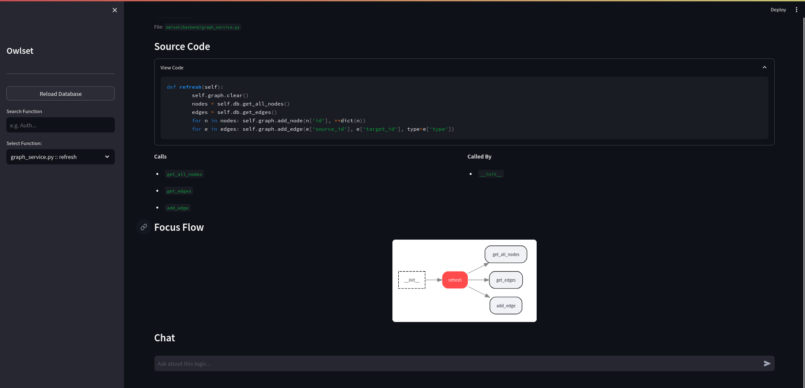

# Owlset

**Owlset** is an intelligent code analysis tool that helps developers understand complex codebases through visual dependency graphs and insights. It makes visualisation and getting through the codebase effiecient and easy, as It targets to link each dependency and How they effect the codebase.
This is a version = 1.0.0 release.

## Screenshots


### Function Analysis View

*Explores function details, dependencies, and call relationships*
### Insights

*Get contextual explanations and detailed analysis of your code chat feature*

### Dependency Visualization

*Visualizes code relationships and understand how functions connect across your codebase*


## Features

- **Dependency Mapping** - Automatically parses and visualizes function-level dependencies across your codebase
- **Interactive Exploration** - Navigate through functions, view call hierarchies, and understand code relationships
- **AI Assistant** - Get contextual answers about your code using integrated AI analysis
- **Visual Flow Graphs** - See who calls what and trace execution paths at a glance
- **Multi-Language Support** - Works with Python, JavaScript, TypeScript, and their variants

## How It Works

Owlset follows a three-stage approach to help you understand your codebase:

### 1. **Parse**
Owlset scans your repository and uses abstract syntax tree (AST) parsing to identify all functions, methods, and their relationships. It recognizes imports, function calls, and dependencies without executing any code.

### 2. **Connect**
The tool builds a knowledge graph by linking function definitions to their usage points. It intelligently resolves which function is being called, even across multiple files, creating a complete map of your code's execution flow.

### 3. **Analyze**
With the graph in place, Owlset provides both visual and conversational interfaces. You can explore dependencies visually or ask natural language questions about specific functions, powered by AI that understands the full context of your codebase.

## Installation

### Prerequisites
- Python 3.10 or higher
- pip package manager

### Setup

1. Clone the repository:
```bash
git clone <repository-url>
cd owlset
```

2. Install dependencies:
```bash
pip install -r requirements.txt
```

3. Configure environment variables (Optional - for AI features):

Create a `.env` file in the project root:
```bash
echo "MISTRAL_API_KEY=your_api_key_here" > .env
```

Or manually create a `.env` file with:
```
MISTRAL_API_KEY=your_mistral_api_key_here
```

## Usage

### Complete Setup Workflow

1. **Place your codebase** in the `data/repo/` directory:
```bash
# Copy your project into data/repo/
cp -r /path/to/your/project ./data/repo/
```

2. **Run the setup script** to parse and analyze:
```bash
python run_setup.py
```

This will:
- Scan all source files in `data/repo/`
- Build the dependency graph
- Generate AI summaries for functions (if MISTRAL_API_KEY is configured)

3. **Launch the Streamlit UI**:
```bash
streamlit run main_app.py
```

4. **Open your browser** and navigate to `http://localhost:8501`

### Using the Interface

1. **Select a Function** - Use the sidebar to search and select any function from your codebase
2. **View Context** - See the function's source code, dependencies (functions it calls), and usages (functions that call it)
3. **Visualize Flow** - Examine the dependency graph to understand relationships
4. **Ask Questions** - Use the chat interface to ask about the function's logic, parameters, or behavior (requires MISTRAL_API_KEY)
5. **Reload Database** - Click "Reload Database" if you've made changes to your codebase

## Configuration

### Environment Variables

- `MISTRAL_API_KEY` - Your Mistral AI API key for AI-powered analysis (optional but recommended)

### Supported File Types

- Python: `.py`
- JavaScript: `.js`, `.jsx`, `.mjs`, `.cjs`
- TypeScript: `.ts`, `.tsx`

## Tech Stack

- **Frontend**: Streamlit
- **Parsing**: Tree-sitter
- **Graph Engine**: NetworkX
- **Visualization**: Graphviz, streamlit-agraph
- **Database**: SQLite
- **AI**: Mistral AI
- **Language**: Python 3.10+

## Project Structure

```
owlset/
├── backend/
│   ├── ai_engine.py        # AI integration for code analysis
│   ├── database.py         # SQLite data layer
│   ├── graph_service.py    # Graph operations and queries
│   ├── orchestrator.py     # Repository scanning coordinator
│   ├── parser_engine.py    # AST parsing for multiple languages
│   └── resolver.py         # Dependency resolution logic
├── data/
│   ├── repo/              # Place repositories here for analysis
│   └── owlset.db          # Generated dependency graph database
├── main_app.py            # Streamlit UI application
└── requirements.txt       # Python dependencies
```

## Contributing

Contributions are welcome! Please feel free to submit issues or pull requests.

## License

MIT License

Copyright (c) 2026 Nishant-k-sagar


---

Built for developers who want to understand code, not just read it.
